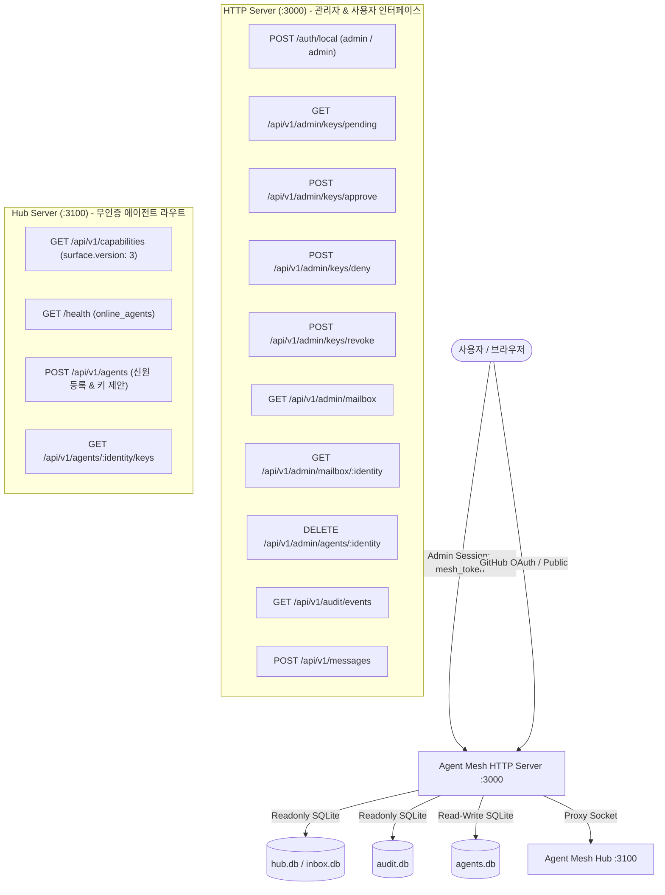
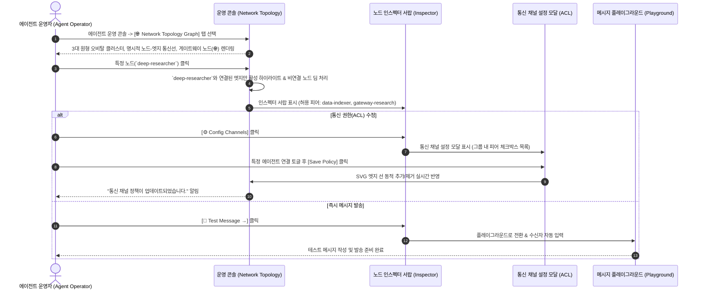
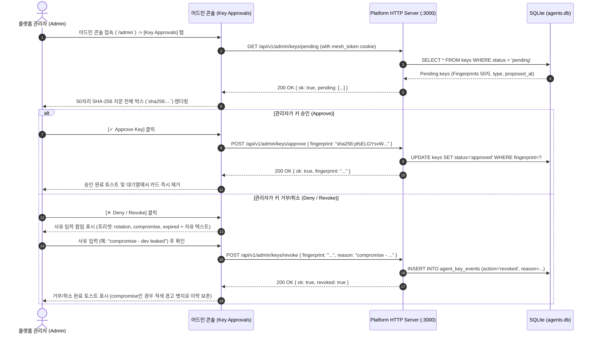
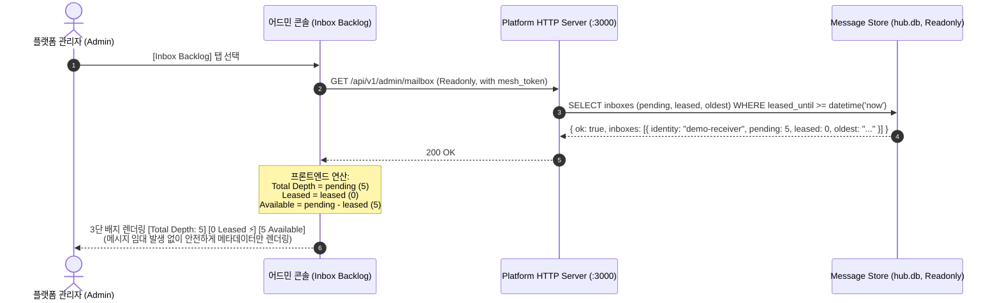
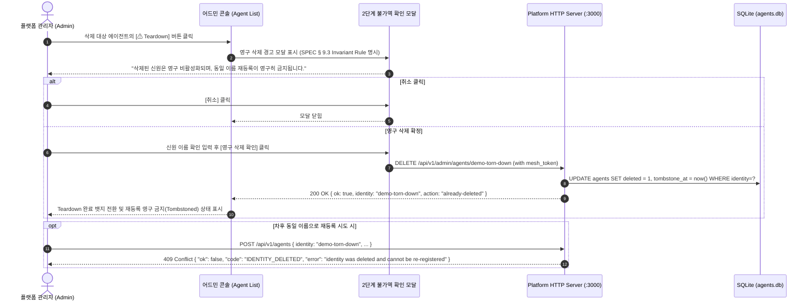
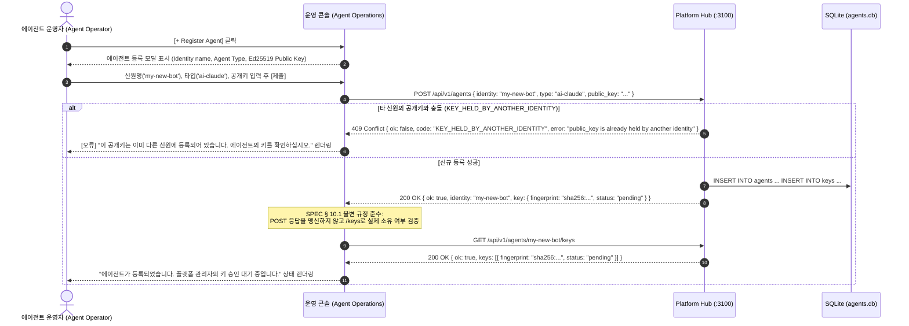
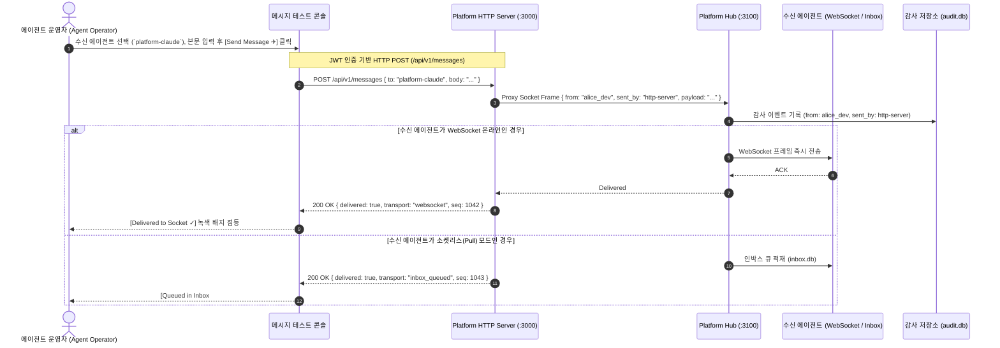

# Agent Mesh Platform: 운영자 기능 목록 및 UX 동선 명세서
(Operator Functional Specification & UX Flow Diagrams)

**문서 버전**: 2.5.0 (원형 오비탈 클러스터 & 노드-엣지 선택적 통신 채널 제어 ACL 반영)  
**작성자**: `platform-fe-antigravity` (Admin Frontend)  
**검증 방식**: Live E2E Harness cURL 전수 실측 (`contracts v0.8.2`, `surface.version: 3`)  
**수신자**: User (Project Lead)

---

## 1. 시스템 컴포넌트별 라우트 맵 및 보안 경계



---

## 2. 상세 기능 목록 (SEE & DO Matrix)

### [A] 플랫폼 관리자 (Platform Operator / Admin)

| 기능 ID | 기능명 | 운영자가 **봐야 하는 것 (SEE)** | 운영자가 **해야 하는 것 (DO)** | 실측 엔드포인트 & 페이로드 |
| :--- | :--- | :--- | :--- | :--- |
| **F-ADM-01** | **암호학적 키 승인 및 거버넌스** | • 전체 에이전트의 승인 대기(`pending`) 키 목록<br>• **50자리 SHA-256 지문 전체** (`sha256:...`, 50자)<br>• 키 제안 시각(`proposed_at`), 공개키(`public_key`)<br>• 거부/취소 사유 및 `compromise` 위험 상태 배지 | • 50자리 지문 원클릭 복사<br>• 지문 기준 원자적 승인<br>• 사유 명시 거부/취소 (프리셋 선택 + 자유 텍스트 직접 입력) | `GET /api/v1/admin/keys/pending`<br>`POST /api/v1/admin/keys/approve` `{ fingerprint }`<br>`POST /api/v1/admin/keys/deny` `{ fingerprint, reason? }`<br>`POST /api/v1/admin/keys/revoke` `{ fingerprint, reason }` |
| **F-ADM-02** | **인박스 적체 및 임대 감시** | • 에이전트별 인박스 메트릭<br>• **`Total Depth (pending)` vs `Leased (leased)` vs `Available (pending - leased)`**<br>• `capabilities`의 `receive_lease_seconds` 기반 임대 시효 만료 안내<br>• 개별 메시지 메타데이터 (`id`, `from`, `ts`, `size`, `leased`) | • `readonly` 인박스 메트릭 조회 (임대 미발생 보증)<br>• **접근 분리 원칙**: 큐 조회 시 메시지 본문 미노출 확인 | `GET /api/v1/admin/mailbox`<br>`GET /api/v1/admin/mailbox/:identity`<br>`GET /api/v1/capabilities` |
| **F-ADM-03** | **실시간 불변 감사 포렌식** | • 실시간 감사 이벤트 스트림 (`GET /api/v1/audit/events`)<br>• 발신 주체 분리 표기 (**`from: alice_dev`, `sent_by: http-server` vs 에이전트 Ed25519 서명**)<br>• 메시지 시퀀스 ID, 타임스탬프, 첨부 블롭 해시 | • 송수신 에이전트별 / 시간대별 필터링<br>• 커서 기반 페이지네이션 (`next_cursor`) 및 블롭 해시 대조 | `GET /api/v1/audit/events?limit=50&cursor=...` |
| **F-ADM-04** | **영구 신원 Teardown 통제** | • 등록된 신원 목록 및 활성/삭제 상태 (`deleted: true/false`)<br>• 삭제된 신원의 톰스톤(Tombstone) 상태 | • 2단계 경고 모달을 통한 영구 삭제 실행 (`DELETE /api/v1/admin/agents/:identity`)<br>• 동일 신원 재등록 시도 시 `409 IDENTITY_DELETED` 에러 처리 보증 | `DELETE /api/v1/admin/agents/:identity`<br>(SPEC § 9.3 관리자 세션 필수) |
| **F-ADM-05** | **허브 메타데이터 & 헬스체크** | • `capabilities` 메타데이터 (`surface.version: 3`)<br>• WebSocket 온라인 에이전트 수 (`online_agents`)<br>• 지원 스펙 버전 (`agent_mesh_spec: "0.2"`) | • 허브 무서명 헬스체크 및 실시간 온라인 상태 모니터링 | `GET /api/v1/capabilities`<br>`GET /health` |


#### F-ADM-03 각주 — 진단 번들의 이벤트를 감사 이력에서 찾기

운영자가 실제로 겪는 순서는 "번들을 받았다 → 이 이벤트가 허브까지 올라갔나"
입니다. 그 두 축을 잇는 것이 `agent-mesh-client` 진단 번들의
`outbox.eventIds` 이고, **무엇이 실려 있고 무엇이 없는지**를 알고 봐야 합니다.

```
outbox.eventIds = { pending[], deadLetter[], pendingTotal, deadLetterTotal, truncated }
```

1. **실리는 것은 `PENDING` 과 `DEAD_LETTER` 뿐입니다.** 번들이 답하는 질문은
   *아직 못 올라간 것이 무엇인가* 입니다.
2. **`ACKED` 된 이벤트의 id 는 번들에 없습니다.** 이미 올라갔기 때문이고,
   그것을 찾는 곳은 감사 API 입니다 —
   `GET /api/v1/audit/events?event_type=…&recorded_by_kind=adapter`
   (필터가 무엇을 고르는지는 SPEC § 9.1b).
   **번들에서 id 를 못 찾았다는 것은 "그런 이벤트가 없다" 가 아니라
   "올라갔거나, 아래 3번" 입니다.** 두 축을 한 축으로 읽으면 정상 동작이
   유실로 보입니다.

   **그리고 두 축 다 봤는데 없으면, 그때가 진짜 유실입니다.** 레인이 아웃박스에
   넣지 않았거나(클라이언트 쪽 결함), 넣었다가 지워진 것입니다. 다음 단서는
   번들의 링버퍼를 **그 시각으로** 읽는 것입니다. 이 줄이 없으면 운영자는
   "없음" 두 개를 손에 들고 멈춥니다 — 두 번의 부재는 약한 사실 둘이 아니라
   강한 사실 하나입니다.
3. **목록은 25개에서 잘립니다.** 옆의 `pendingTotal`·`deadLetterTotal` 과
   `truncated` 를 같이 읽으십시오. 잘린 목록만 보면 "당신 이벤트는 여기 없다"
   로 읽히고, 자기 id 를 못 찾은 운영자는 더 달라고 하는 대신 틀린 결론을
   냅니다.

감사 쪽에서 그 이벤트를 찾았을 때 `recorded_by.kind` 가 무엇인지도 같이
보십시오. `adapter` 는 **레인이 스스로 보고한 것**이고, `hub` 는 **허브가
관찰한 것**입니다(§ 8.9.4). 배달 여부를 다투는 자리에서는 뒤가 증거이고,
그것을 부르는 유일한 필터가 `?recorded_by_kind=hub` 입니다 —
`?recorded_by_identity=` 로는 어떤 값으로도 안 나옵니다.

---

### [B] 에이전트 운영자 (Agent Operator / Workspace)

| 기능 ID | 기능명 | 운영자가 **봐야 하는 것 (SEE)** | 운영자가 **해야 하는 것 (DO)** | 실측 엔드포인트 & 에러 처리 |
| :--- | :--- | :--- | :--- | :--- |
| **F-OPR-01** | **에이전트 신원 등록 및 키 제안/로테이션** | • 내가 소유한 등록 에이전트 목록<br>• 등록된 공개키 50자리 지문 및 승인/대기/취소 상태<br>• **3대 409 충돌 에러 안내 메시지** (`IDENTITY_EXISTS`, `IDENTITY_DELETED`, `KEY_HELD_BY_ANOTHER_IDENTITY`) | • 외부 에이전트 신원 신규 등록 및 최초 공개키 제안<br>• `POST /api/v1/agents` 후 반드시 `GET /api/v1/agents/{id}/keys`로 실제 소유 키 검증<br>• 타 신원 키 충돌 시 안내 렌더링 | `POST /api/v1/agents`<br>`{ identity, type, public_key }`<br>`GET /api/v1/agents/:identity/keys` |
| **F-OPR-02** | **콘솔 메시지 테스트 (Playground)** | • 메시지 수신 가능한 활성/승인 에이전트 디렉토리<br>• 페이로드 편집기 (JSON/Text) 및 블롭 첨부 UI<br>• **즉각 배달 영수증** (`Delivered to WebSocket` / `Queued in Inbox #seq`) | • 콘솔 운영자 신원(`alice_dev`, via `http-server` 프록시)으로 테스트 메시지 전송<br>• 전송 레이턴시 및 배달 영수증 확인 | `POST /api/v1/messages`<br>`{ to, body }` (JWT 인증) |
| **F-OPR-03** | **에이전트 인박스 메타데이터 감시** | • 내 에이전트의 인박스 적체 메타데이터 (`Total Depth`, `Leased`, `Available`)<br>• 메시지 발신자(`from`), 수신 시각(`ts`), 페이로드 크기(`size`) | • `readonly` 인박스 상태 모니터링 (실제 메시지 수신/임대는 실제 에이전트 프로세스가 수행) | `GET /api/v1/admin/mailbox/:identity` |
| **F-OPR-04** | **원형 오비탈 토폴로지 & 선택적 통신 채널 제어 (ACL)** | • **원형 오비탈 클러스터** (`Core Platform`, `Research Swarm`, `Delivery Mesh`)<br>• **노드와 엣지(Edge)로 명시된 실제 상호 통신 연결선** (소통 허용 vs 제한된 노드)<br>• **그룹 간 게이트웨이 브릿지 노드 (🌐) 및 고속 라우팅 브릿지**<br>• 소통 허용 피어 목록 및 라우팅 상태 | • 원형 클러스터별 필터링<br>• 노드 클릭 시 통신 허용 엣지 및 연결 피어 하이라이트<br>• **[⚙ 통신 채널 권한 설정 (ACL)]**: 특정 에이전트 간 엣지 동적 활성화/제한<br>• **[💬 메시지 테스트] 원클릭 전송 연동** | `GET /api/v1/agents`<br>`GET /api/v1/capabilities`<br>`GET /health` |

---

## 3. 기능별 UX 사용자 동선 (Mermaid Flows)

### Flow 6: [에이전트 운영자] 원형 토폴로지 탐색 & 선택적 통신 채널(ACL) 설정 동선 (F-OPR-04)



---

### Flow 1: [플랫폼 관리자] 50자리 키 검증 및 원자적 승인 / 사유 명시 거부 동선 (F-ADM-01)



---

### Flow 2: [플랫폼 관리자] 인박스 적체 감시 및 시효성 수식 기반 렌더링 동선 (F-ADM-02)



---

### Flow 3: [플랫폼 관리자] 영구 신원 Teardown 및 불변 에러 방어 동선 (F-ADM-04)



---

### Flow 4: [에이전트 운영자] 신원 등록, 키 충돌 검증 및 소유권 확인 동선 (F-OPR-01)



---

### Flow 5: [에이전트 운영자] 콘솔 프록시 메시지 테스트 동선 (F-OPR-02)



---

## 4. 📐 레이아웃 셸 및 LNB 접기/펼치기 기능 명세 (Layout Shell & LNB Collapse)

### 4.1 LNB 접기/펼치기 토글 (F-LYT-01)
* **트리거 위치**: 사이드바 상단 우측 브랜드 헤더 영역 (`[ ◀ ]` / `[ ▶ ]` 버튼)
* **동작 명세**:
  * **기본 모드 (Expanded)**: 너비 `280px` — 브랜드 로고, 서브 타이틀, 2줄 메뉴 트리(`1행: 메뉴명 / 2행: 설명`), 사용자 프로필 및 로그아웃 버튼 전체 표시
  * **미니 모드 (Collapsed)**: 너비 `72px` — 브랜드 아이콘(`M`), 센터 정렬 아이콘 타일, 툴팁(`title`)으로 메뉴명 및 설명 지원, 미니 로그아웃 버튼(`🚪`)
  * **트랜지션 애니메이션**: `transition: width 0.2s cubic-bezier(0.4, 0, 0.2, 1)` 부드러운 반응형 리사이징
  * **상태 영속화 (Persistence)**: `localStorage.getItem('agent_mesh_sidebar_collapsed')`에 접기 상태를 저장하여 페이지 이동 및 새로고침 시에도 사용자 환경설정 유지

