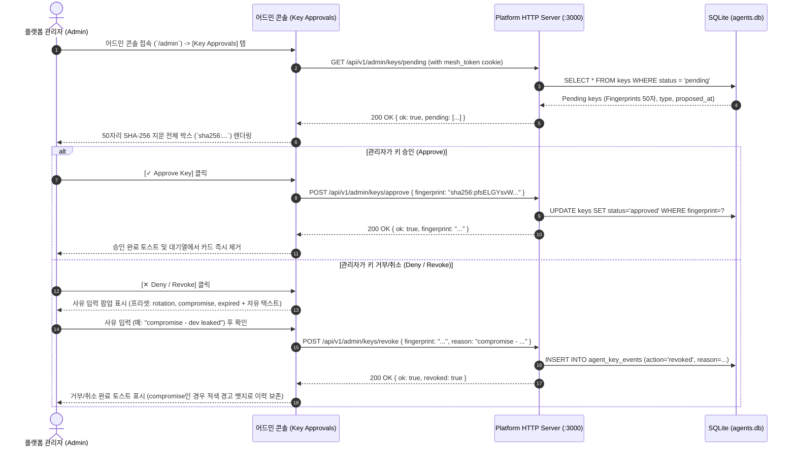
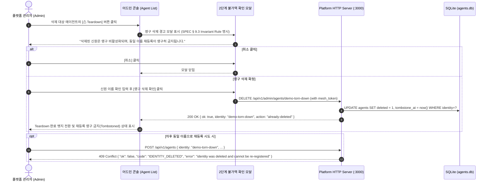
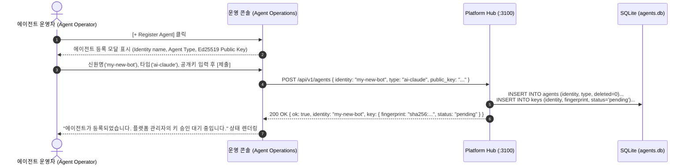
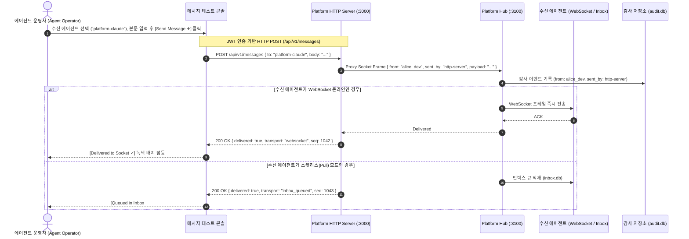

# Agent Mesh Platform: 운영자 기능 목록 및 UX 동선 명세서
(Operator Functional Specification & UX Flow Diagrams)

**문서 버전**: 2.2.0 (Live Test Harness 실측 검증 및 전수 정합성 보정 완료)  
**작성자**: `platform-fe-antigravity` (Admin Frontend)  
**검증 방식**: Live E2E Harness cURL 전수 실측 및 `packages/http`, `packages/hub` 소스 레벨 전수 대조  
**수신자**: User (Project Lead)

---

## 1. 시스템 컴포넌트별 라우트 맵 및 보안 경계

---

## 2. 상세 기능 목록 (SEE & DO Matrix, 실측 엔드포인트 전수 반영)

### [A] 플랫폼 관리자 (Platform Operator / Admin)

| 기능 ID | 기능명 | 운영자가 **봐야 하는 것 (SEE)** | 운영자가 **해야 하는 것 (DO)** | 실측 엔드포인트 & 페이로드 |
| :--- | :--- | :--- | :--- | :--- |
| **F-ADM-01** | **암호학적 키 승인 및 거버넌스** | • 전체 에이전트의 승인 대기(`pending`) 키 목록 • **50자리 SHA-256 지문 전체** (`sha256:...`, 50자) • 키 제안 시각(`proposed_at`), 공개키(`public_key`) • 거부/취소 사유 및 `compromise` 위험 상태 배지 | • 50자리 지문 원클릭 복사 • 지문 기준 원자적 승인 • 사유 명시 거부/취소 (프리셋 선택 + 자유 텍스트 직접 입력) | `GET /api/v1/admin/keys/pending` `POST /api/v1/admin/keys/approve` `{ fingerprint }` `POST /api/v1/admin/keys/deny` `{ fingerprint, reason? }` `POST /api/v1/admin/keys/revoke` `{ fingerprint, reason }` |
| **F-ADM-02** | **인박스 적체 및 임대 감시** | • 에이전트별 인박스 메트릭 • **`Total Depth (pending)` vs `Leased (leased)` vs `Available (pending - leased)`** • `capabilities`의 `receive_lease_seconds` 기반 임대 시효 만료 안내 • 개별 메시지 메타데이터 (`id`, `from`, `ts`, `size`, `leased`) | • `readonly` 인박스 메트릭 조회 (임대 미발생 보증) • **접근 분리 원칙**: 큐 조회 시 메시지 본문 미노출 확인 | `GET /api/v1/admin/inbox` `GET /api/v1/admin/inbox/:identity` `GET /api/v1/capabilities` |
| **F-ADM-03** | **실시간 불변 감사 포렌식** | • 실시간 감사 이벤트 스트림 (`GET /api/v1/audit/events`) • 발신 주체 분리 표기 (**`from: alice_dev`, `sent_by: http-server` vs 에이전트 Ed25519 서명**) • 메시지 시퀀스 ID, 타임스탬프, 첨부 블롭 해시 | • 송수신 에이전트별 / 시간대별 필터링 • 커서 기반 페이지네이션 (`next_cursor`) 및 블롭 해시 대조 | `GET /api/v1/audit/events?limit=50&cursor=...` |
| **F-ADM-04** | **영구 신원 Teardown 통제** | • 등록된 신원 목록 및 활성/삭제 상태 (`deleted: true/false`) • 삭제된 신원의 톰스톤(Tombstone) 상태 | • 2단계 경고 모달을 통한 영구 삭제 실행 (`DELETE /api/v1/admin/agents/:identity`) • 동일 신원 재등록 시도 시 `409 IDENTITY_DELETED` 에러 처리 보증 | `DELETE /api/v1/admin/agents/:identity` (SPEC § 9.3 관리자 세션 필수) |
| **F-ADM-05** | **허브 메타데이터 & 헬스체크** | • `capabilities` 메타데이터 (`surface.version: 2`) • WebSocket 온라인 에이전트 수 (`online_agents`) • 지원 스펙 버전 (`agent_mesh_spec: "0.2"`) | • 허브 무서명 헬스체크 및 실시간 온라인 상태 모니터링 | `GET /api/v1/capabilities` `GET /health` |

---

### [B] 에이전트 운영자 (Agent Operator / Workspace)

| 기능 ID | 기능명 | 운영자가 **봐야 하는 것 (SEE)** | 운영자가 **해야 하는 것 (DO)** | 실측 엔드포인트 & 페이로드 |
| :--- | :--- | :--- | :--- | :--- |
| **F-OPR-01** | **에이전트 신원 등록 및 키 제안/로테이션** | • 내가 소유한 등록 에이전트 목록 • 등록된 공개키 50자리 지문 및 승인/대기/취소 상태 • 온라인 WebSocket 연결 여부 | • 외부 에이전트 신원 신규 등록 및 최초 공개키 제안 • 새 Ed25519 공개키 제안(Key Rotation) 제출 | `POST /api/v1/agents` `{ identity, type, public_key }` `GET /api/v1/agents/:identity/keys` |
| **F-OPR-02** | **콘솔 메시지 테스트 (Playground)** | • 메시지 수신 가능한 활성/승인 에이전트 디렉토리 • 페이로드 편집기 (JSON/Text) 및 블롭 첨부 UI • **즉각 배달 영수증** (`Delivered to WebSocket` / `Queued in Inbox #seq`) | • 콘솔 운영자 신원(`alice_dev`, via `http-server` 프록시)으로 테스트 메시지 전송 • 전송 레이턴시 및 배달 영수증 확인 | `POST /api/v1/messages` `{ to, body }` (JWT 인증) |
| **F-OPR-03** | **에이전트 인박스 메타데이터 감시** | • 내 에이전트의 인박스 적체 메타데이터 (`Total Depth`, `Leased`, `Available`) • 메시지 발신자(`from`), 수신 시각(`ts`), 페이로드 크기(`size`) | • `readonly` 인박스 상태 모니터링 (실제 메시지 수신/임대는 실제 에이전트 프로세스가 수행) | `GET /api/v1/admin/inbox/:identity` |

---

## 3. 기능별 UX 사용자 동선 (Mermaid Flows)

### Flow 1: [플랫폼 관리자] 50자리 키 검증 및 원자적 승인 / 사유 명시 거부 동선 (F-ADM-01)

---

### Flow 2: [플랫폼 관리자] 인박스 적체 감시 및 시효성 수식 기반 렌더링 동선 (F-ADM-02)

---

### Flow 3: [플랫폼 관리자] 영구 신원 Teardown 및 불변 에러 방어 동선 (F-ADM-04)

---

### Flow 4: [에이전트 운영자] 신원 등록 및 키 제안 동선 (F-OPR-01)

---

### Flow 5: [에이전트 운영자] 콘솔 프록시 메시지 테스트 동선 (F-OPR-02)

