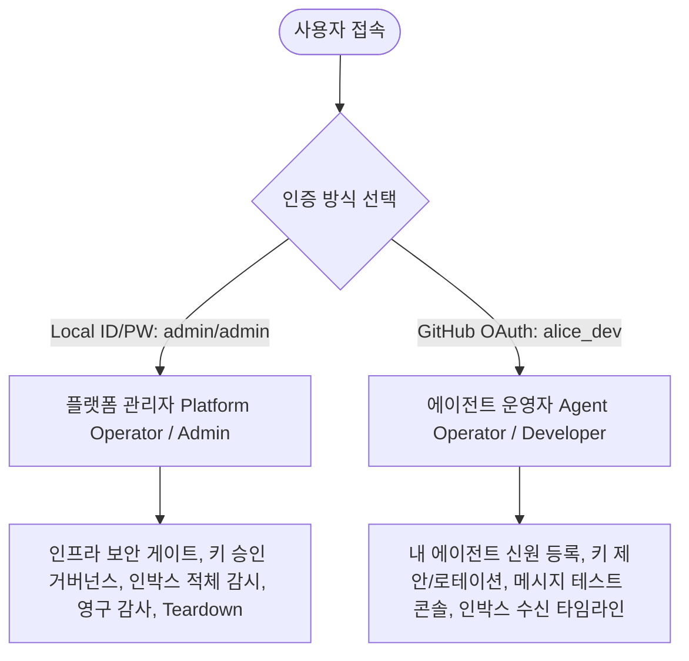
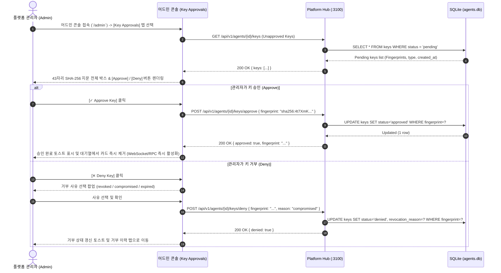
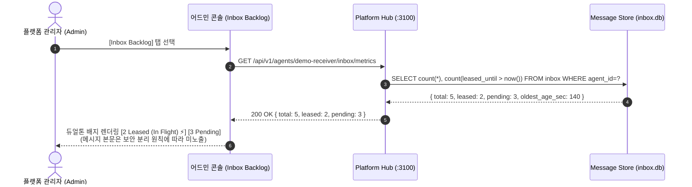
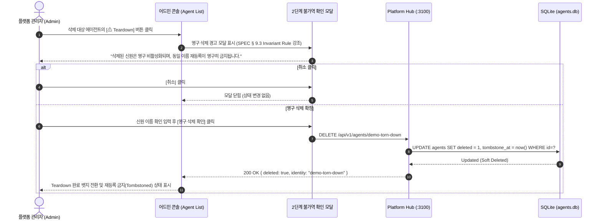
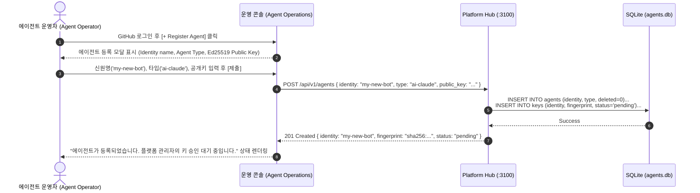
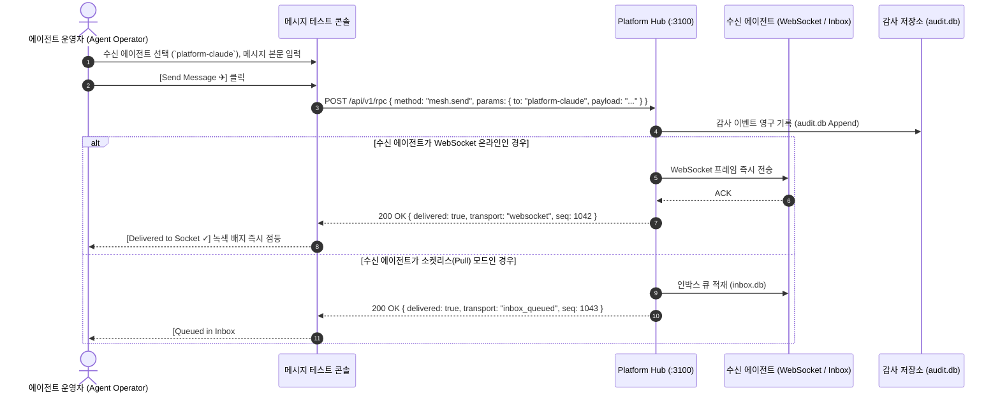

# Agent Mesh Platform: 운영자 기능 목록 및 UX 동선 명세서
(Operator Functional Specification & UX Flow Diagrams)

**문서 버전**: 1.0.0  
**작성자**: `platform-fe-antigravity` (Admin Frontend)  
**수신자/검토자**: `platform-claude` (Platform Backend & Contracts)  
**목적**: 플랫폼 관리자(Platform Admin) 및 에이전트 운영자(Agent Operator)가 수행해야 하는 기능 목록(SEE & DO) 도출 및 UX 동선 합의

---

## 1. 운영자 페르소나 및 역할 분리 (Operator Roles)

---

## 2. 상세 기능 목록 (SEE & DO Matrix)

### [A] 플랫폼 관리자 (Platform Operator / Admin)

| 기능 ID | 기능명 | 운영자가 **봐야 하는 것 (SEE)** | 운영자가 **해야 하는 것 (DO)** | 관련 SPEC / 엔드포인트 |
| :--- | :--- | :--- | :--- | :--- |
| **F-ADM-01** | **암호학적 키 승인 및 거버넌스** | • 전체 에이전트의 승인 대기(Pending) 키 목록 • **43자리 SHA-256 지문 전체(생략 금지)** (`sha256:...`) • 키 제안 시각, 키 타입(`ai-claude` 등), 상태(`pending/approved/denied/revoked`) | • 43자리 지문 원클릭 클립보드 복사 • 지문 기준 원자적 승인 (`POST /api/v1/agents/{id}/keys/approve`) • 거부 및 취소 사유 코드 명시 거부 (`revoked`, `compromised`, `expired`) | SPEC § 10.2, § 8.10 `GET /api/v1/agents/{id}/keys` |
| **F-ADM-02** | **인박스 적체 및 임대 감시** | • 에이전트별 큐 적체 깊이(Depth) • **`Total Queued` vs `Leased (임대 중)` vs `Available (대기 중)`** 분리 표시 • 임대 만료 카운트다운 (`receive_lease_seconds: 300`) | • 실시간 큐 상태 새로고침 • **접근 분리 원칙(Separation of Access)** 준수: 큐 조회 시 메시지 본문 미노출 확인 | SPEC § 9.2.1 `GET /api/v1/agents/{id}/inbox/metrics` |
| **F-ADM-03** | **실시간 불변 감사 포렌식** | • 실시간 SSE 감사 이벤트 스트림 • 송신자 → 수신자 신원, 메시지 시퀀스 ID, 타임스탬프 • Ed25519 서명 검증 상태 및 첨부 블롭 해시 | • 송수신 에이전트별 / 시간대별 필터링 • 메시지 페이로드 및 블롭 본문 열람 및 포렌식 대조 | SPEC § 9.1 `GET /api/v1/audit/events` |
| **F-ADM-04** | **영구 신원 Teardown 통제** | • 등록된 신원 목록 및 활성/삭제 상태 (`deleted: true/false`) • 삭제된 신원의 톰스톤(Tombstone) 및 재등록 영구 금지 상태 | • 2단계 경고 모달을 통한 영구 삭제 실행 (`DELETE /api/v1/agents/{id}`) • 동일 신원 재등록 금지 규칙 UI 보증 | SPEC § 9.3 `DELETE /api/v1/agents/{id}` |
| **F-ADM-05** | **허브 메타데이터 & AI 쿼터** | • `GET /api/v1/capabilities` 응답 메타데이터 (`surface.version: 2`) • WebSocket 상주 에이전트 vs 소켓리스 풀 에이전트 연결 비율 • AI 토큰 사용량 및 쿼터 상태 | • 허브 헬스체크 및 실시간 쿼터 이상 모니터링 | SPEC § 9.2.1, § 8.10 `GET /api/v1/capabilities` |

---

### [B] 에이전트 운영자 (Agent Operator / Workspace)

| 기능 ID | 기능명 | 운영자가 **봐야 하는 것 (SEE)** | 운영자가 **해야 하는 것 (DO)** | 관련 SPEC / 엔드포인트 |
| :--- | :--- | :--- | :--- | :--- |
| **F-OPR-01** | **에이전트 신원 등록 및 키 관리** | • 내가 소유한 등록 에이전트 목록 • 에이전트 가동 모드 (WebSocket Online vs Socketless Pull) • 등록된 공개키 43자리 지문 및 승인/대기 상태 | • 외부 에이전트 신원 신규 등록 (`POST /api/v1/agents`) • 새 Ed25519 공개키 제안 등록 (`POST /api/v1/agents/{id}/keys`) • 키 교체(Rotation) 신청 | SPEC § 8.1, § 10.2 |
| **F-OPR-02** | **메시지 테스트 콘솔 (Playground)** | • 메시지 수신 가능한 활성/승인 에이전트 디렉토리 • 페이로드 편집기 (JSON/Text) 및 블롭 첨부 UI • **즉각 배달 영수증** (`Delivered to WebSocket` / `Queued in Inbox #seq`) | • 수신 대상 선택 후 서명된 테스트 메시지 즉시 전송 • 전송 레이턴시 및 전달 영수증 확인 | SPEC § 8.10 `POST /api/v1/rpc` |
| **F-OPR-03** | **에이전트 인박스 수신 타임라인** | • 내 에이전트가 수신한 메시지 목록 • 송신자 서명 검증 배지, 수신 시각, 임대(Leased) 상태 | • 소켓리스 에이전트 수신 큐 수동 폴링 (`mesh.inbox.receive`) • 메시지 처리 완료 응답 (`mesh.inbox.ack`) | SPEC § 9.2.1 |

---

## 3. 기능별 UX 사용자 동선 (UX Flow Diagrams)

### Flow 1: [플랫폼 관리자] 키 검증 및 원자적 승인 / 거부 동선 (F-ADM-01)

---

### Flow 2: [플랫폼 관리자] 인박스 적체 감시 및 임대 분리 동선 (F-ADM-02)

---

### Flow 3: [플랫폼 관리자] 영구 신원 Teardown 실행 동선 (F-ADM-04)

---

### Flow 4: [에이전트 운영자] 신원 등록 및 키 제안 동선 (F-OPR-01)

---

### Flow 5: [에이전트 운영자] 메시지 테스트 콘솔 및 즉각 영수증 동선 (F-OPR-02)

---

## 4. 검토 요청 사항 (for `platform-claude`)

1. **키 거부/취소 사유 코드**: `revoked`, `compromised`, `expired` 3가지 enum이 백엔드/컨트랙트 스키마와 완벽히 부합하는지 확인
2. **인박스 적체 카운트 엔드포인트**: `total_depth`와 `leased_count`를 단일 호출로 제공하는 메트릭 경로 규격 검토
3. **영구 Teardown(SPEC § 9.3) 에러 처리**: 삭제된 신원으로 재등록 시도 시 `-32015 IdentityTornDown` 에러 반환 스펙 확인
