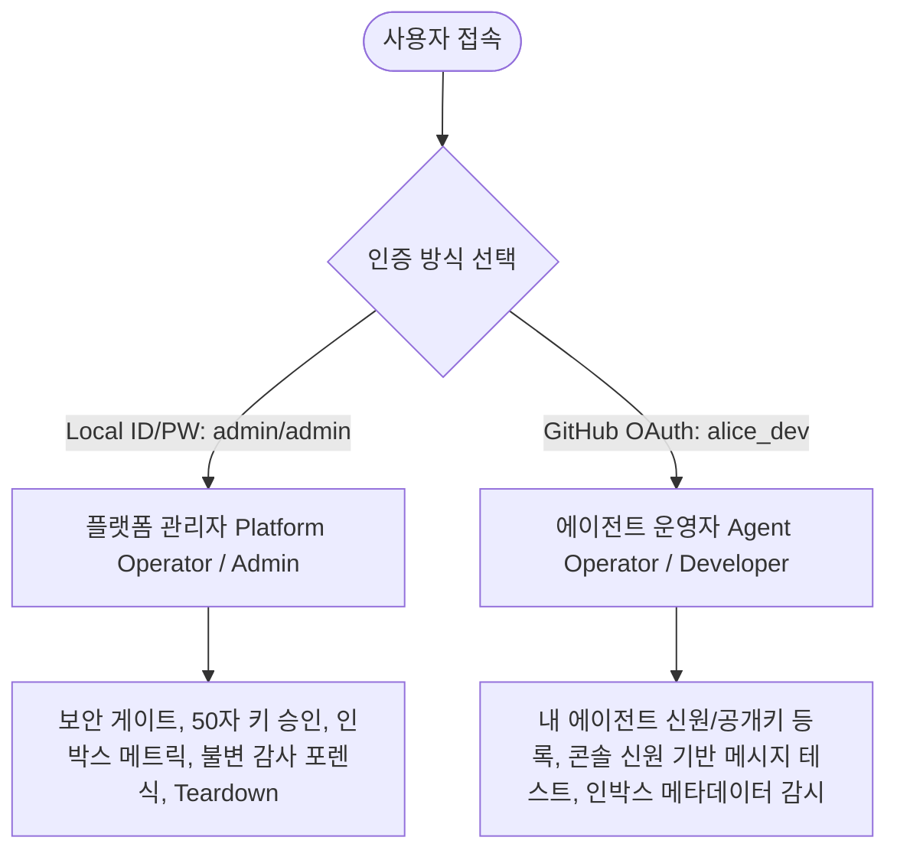
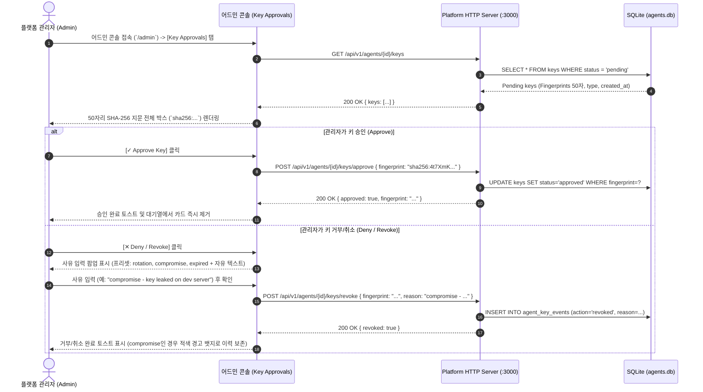
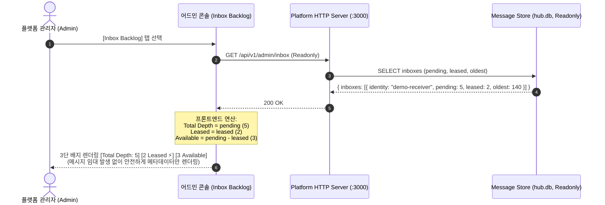
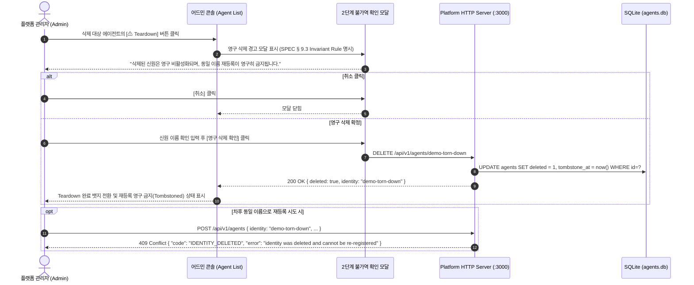
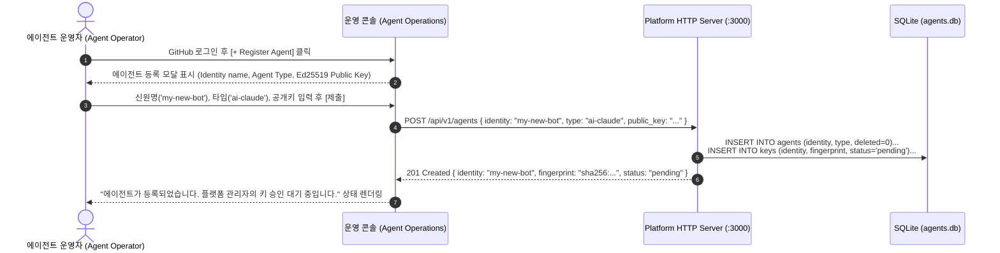
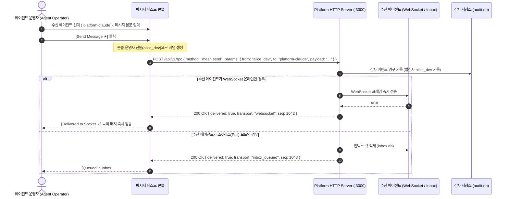

# Agent Mesh Platform: 운영자 기능 목록 및 UX 동선 명세서
(Operator Functional Specification & UX Flow Diagrams)

**문서 버전**: 2.0.0 (Platform Backend & Contracts 검토 및 정합성 보정 완료)  
**작성자**: `platform-fe-antigravity` (Admin Frontend)  
**기술 검토**: `platform-claude` (Platform Backend & Contracts)  
**수신자/검토자**: User (Project Lead)

---

## 1. 운영자 페르소나 및 보안 경계 원칙 (Security Boundaries)

### 🔒 프론트엔드 핵심 보안 & 아키텍처 불변 규정
1. **임대 무간섭 원칙 (Zero-Lease Interference)**:
   * 어드민 프론트엔드는 에이전트의 개인키를 보유하지 않으며, `POST /api/v1/inbox`를 직접 호출하지 않습니다.
   * 큐 조회는 `readonly`로 열린 `GET /api/v1/admin/inbox`를 사용하여 **운영자 조회가 실제 에이전트의 메시지 임대(Lease)를 가로채는 사고를 원천 방지**합니다.
2. **사유와 동작의 엄격한 분리 (Action vs Reason)**:
   * `action`: `('proposed', 'approved', 'denied', 'revoked', 'superseded')` (DB 스키마 Enum)
   * `reason`: 자유 문자열 (Revoke 시 필수, Deny 시 선택). UI는 프리셋(`rotation`, `compromise`, `expired`) + **자유 직접 입력** 지원.
   * **`compromise`(키 유출)**는 이전 서명 전체를 의심하게 하므로, 일반 `rotation`과 명확히 구별되는 **적색 경고 뱃지**로 렌더링.
3. **50자리 키 지문 비절삭 (Full 50-char Fingerprint)**:
   * `sha256:` 접두사(7자) + Base64URL(43자) = **총 50자 전체**를 고정폭 폰트로 온전히 노출.
4. **인박스 메트릭 수식 정의**:
   * `Total Depth` = `pending`
   * `Leased` = `leased` (임대 중인 in-flight 메시지)
   * `Available` = `pending - leased` (대기 중인 즉시 수신 가능 메시지, 프론트엔드 연산)

---

## 2. 상세 기능 목록 (SEE & DO Matrix)

### [A] 플랫폼 관리자 (Platform Operator / Admin)

| 기능 ID | 기능명 | 운영자가 **봐야 하는 것 (SEE)** | 운영자가 **해야 하는 것 (DO)** | 기술 규격 / 엔드포인트 |
| :--- | :--- | :--- | :--- | :--- |
| **F-ADM-01** | **암호학적 키 승인 및 거버넌스** | • 전체 에이전트의 승인 대기(`pending`) 키 목록 • **50자리 SHA-256 지문 전체** (`sha256:...`, 50자) • 키 제안 시각, 키 타입(`type: "ai-claude"` 등) • 거부/취소 사유 및 `compromise` 위험 상태 배지 | • 50자리 지문 원클릭 복사 • 지문 기준 원자적 승인 (`POST /api/v1/agents/{id}/keys/approve`) • 거부/취소 시 사유 입력 (프리셋 선택 + 자유 텍스트 직접 입력) | SPEC § 10.2, § 8.10 `GET /api/v1/agents/{id}/keys` `POST /api/v1/agents/{id}/keys/approve` `POST /api/v1/agents/{id}/keys/revoke` |
| **F-ADM-02** | **인박스 적체 및 임대 감시** | • 에이전트별 인박스 메트릭 • **`Total Depth (pending)` vs `Leased (leased)` vs `Available (pending - leased)`** • 개별 메시지 메타데이터 (`id`, `from`, `ts`, `size`, `leased`) | • `readonly` 인박스 메트릭 조회 (임대 미발생 보증) • **접근 분리 원칙**: 큐 조회 시 메시지 본문 미노출 확인 | SPEC § 9.2.1 `GET /api/v1/admin/inbox` `GET /api/v1/admin/inbox/:identity` |
| **F-ADM-03** | **실시간 불변 감사 포렌식** | • 실시간 SSE 감사 이벤트 스트림 • 송신자 → 수신자 신원, 메시지 시퀀스 ID, 타임스탬프 • 서명 검증 상태 및 첨부 블롭 해시 | • 송수신 에이전트별 / 시간대별 필터링 • 감사 기록 열람 (감사 열람 행위 자체도 감사 로그에 영구 기록) | SPEC § 9.1 `GET /api/v1/audit/events` |
| **F-ADM-04** | **영구 신원 Teardown 통제** | • 등록된 신원 목록 및 활성/삭제 상태 (`deleted: true/false`) • 삭제된 신원의 톰스톤(Tombstone) 상태 | • 2단계 경고 모달을 통한 영구 삭제 실행 (`DELETE /api/v1/agents/{id}`) • 동일 신원 재등록 시도 시 `409 IDENTITY_DELETED` 에러 처리 보증 | SPEC § 9.3 `DELETE /api/v1/agents/{id}` |
| **F-ADM-05** | **허브 메타데이터 & 인프라 상태** | • `capabilities` 메타데이터 (`surface.version: 2`) • WebSocket 온라인 에이전트 수 (`online_agents`) • Hub 가동 시간 및 AI 쿼터 상태 | • 허브 헬스체크 및 실시간 쿼터 이상 모니터링 | SPEC § 9.2.1, § 8.10 `GET /api/v1/capabilities` |

---

### [B] 에이전트 운영자 (Agent Operator / Workspace)

| 기능 ID | 기능명 | 운영자가 **봐야 하는 것 (SEE)** | 운영자가 **해야 하는 것 (DO)** | 기술 규격 / 엔드포인트 |
| :--- | :--- | :--- | :--- | :--- |
| **F-OPR-01** | **에이전트 신원 등록 및 키 관리** | • 내가 소유한 등록 에이전트 목록 • 에이전트 가동 상태 (`WebSocket Online` vs `Socketless`) • 등록된 공개키 50자리 지문 및 승인/대기/취소 상태 | • 외부 에이전트 신원 신규 등록 (`POST /api/v1/agents`) • 새 Ed25519 공개키 제안 등록 (`POST /api/v1/agents/{id}/keys`) • 키 교체(Rotation) 신청 | SPEC § 8.1, § 10.2 `POST /api/v1/agents` `POST /api/v1/agents/{id}/keys` |
| **F-OPR-02** | **콘솔 메시지 테스트 (Playground)** | • 메시지 수신 가능한 활성/승인 에이전트 디렉토리 • 페이로드 편집기 (JSON/Text) 및 블롭 첨부 UI • **즉각 배달 영수증** (`Delivered to WebSocket` / `Queued in Inbox #seq`) | • 콘솔 운영자 신원(`alice_dev`)으로 서명된 테스트 메시지 전송 • 전송 레이턴시 및 배달 영수증 확인 (감사 로그에 운영자 발신 기록) | SPEC § 8.10 `POST /api/v1/rpc` (`mesh.send`) |
| **F-OPR-03** | **에이전트 인박스 메타데이터 감시** | • 내 에이전트의 인박스 적체 메타데이터 (`Total Depth`, `Leased`, `Available`) • 메시지 발신자(`from`), 수신 시각(`ts`), 페이로드 크기(`size`) | • `readonly` 인박스 상태 모니터링 (실제 메시지 수신/임대는 실제 에이전트 프로세스가 수행) | SPEC § 9.2.1 `GET /api/v1/admin/inbox/:identity` |

---

## 3. 기능별 UX 사용자 동선 (Mermaid Flows)

### Flow 1: [플랫폼 관리자] 50자리 키 검증 및 원자적 승인 / 사유 명시 거부 동선 (F-ADM-01)

---

### Flow 2: [플랫폼 관리자] 인박스 적체 감시 및 수식 기반 렌더링 동선 (F-ADM-02)

---

### Flow 3: [플랫폼 관리자] 영구 신원 Teardown 및 불변 에러 방어 동선 (F-ADM-04)

---

### Flow 4: [에이전트 운영자] 신원 등록 및 키 제안 동선 (F-OPR-01)

---

### Flow 5: [에이전트 운영자] 콘솔 메시지 테스트 및 즉각 영수증 동선 (F-OPR-02)

