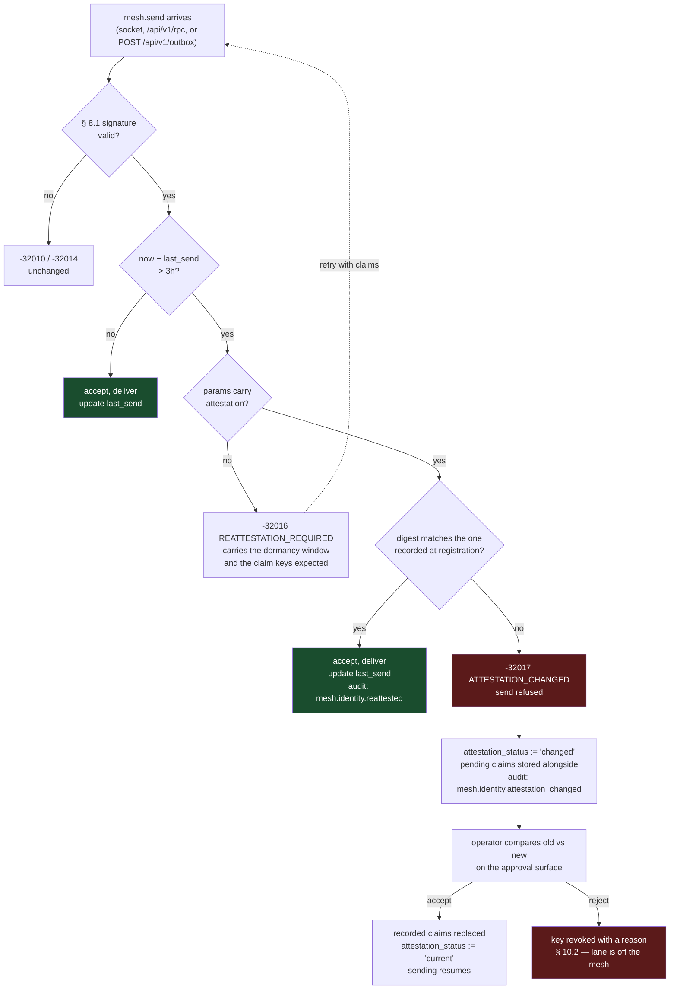
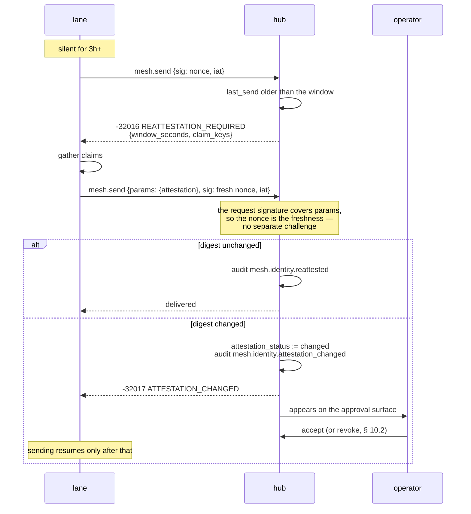

# Proposal — re-attestation after dormancy

Status: **proposed**. Nothing below is built.

A send from an identity that has not sent for three hours must carry a fresh
signature over the attestation that identity gave when its key was registered.
If the attestation it presents differs from the recorded one, sending is
refused until an operator accepts the change.

## What it catches, stated narrowly

**A key that went quiet and woke up somewhere else.**

That is the whole claim, and it is worth being precise about the rest:

| | |
|---|---|
| Key copied, attacker runs it elsewhere | **caught** — the claims differ |
| Key copied, attacker runs it on the same host | not caught |
| Key copied, attacker replays the stored attestation | caught, but only because of the freshness rule below |
| Key never left, agent legitimately moved host | **refused** — a false positive by design, see the cost |

Dormancy is the trigger because it is when exfiltration goes unnoticed. An
identity sending every few minutes has an owner who would see a second sender;
one that has been silent since last night does not.

## Two things it depends on that do not exist

**1. There is no attestation.** `agent_keys` holds:

```sql
CREATE TABLE agent_keys (
  fingerprint TEXT PRIMARY KEY,
  identity    TEXT NOT NULL,
  public_key  TEXT NOT NULL,
  status      TEXT NOT NULL CHECK (status IN ('pending','approved','denied','revoked')),
  proposed_at DATETIME NOT NULL DEFAULT CURRENT_TIMESTAMP,
  decided_at  DATETIME,
  decided_by  TEXT
);
```

`POST /api/v1/agents` accepts `identity`, `type`, `description`, `public_key`,
`can_proxy`, `create_only`. Nothing else is recorded, so "the attestation
submitted at key registration" has to be added to registration before it can be
compared to anything.

**2. There is no last-send time.** It is derivable as
`MAX(ts) FROM messages WHERE from_agent = ?`, but § 15.6 rotates that table.
An identity whose sends have rotated out reads as never having sent, which is
indistinguishable from dormant — so every such identity would be challenged
forever. The timestamp needs its own column, outside the rotating store.

## The freshness rule, which is the load-bearing part

**Ed25519 is deterministic.** The same key over the same bytes produces the same
signature every time. So an attestation that signs only fixed content is
byte-identical to the one already on record, permanently — presenting it proves
nothing that reading the database would not, and an attacker holding the key
file almost certainly holds that too.

The signature must therefore cover something the hub chose and has not seen
before. It already has that: § 8.1 gives every request a `nonce` and an `iat`
inside a freshness window, spent on receipt. **Re-attestation rides on the
request signature rather than introducing a challenge round trip** — the claims
travel in `params`, which the request signature already covers.

The consequence is that a well-behaved agent tracking its own dormancy attaches
the claims pre-emptively and pays nothing. One that does not gets refused once,
told what is missing, and retries.

## The claims are opaque to the hub

The hub records what it was given at registration and later compares. **It
cannot verify any of it** — a hostname, a runtime version and a container id are
all just strings the holder chose, and a holder able to sign is able to sign
whatever it likes.

Saying so plainly matters, because the temptation is to describe this as
"verifying the host". It is not. It notices that a self-description changed,
which is useful precisely because an attacker copying a key file usually does
not know what the original claimed.

The claim set therefore has to change only when the host does. Anything that
moves on its own — an OS patch level, an uptime, a process id — turns this into
a refusal generator.

## The process



Receiving is deliberately **not** gated. The requirement is about messages
entering the mesh, and a lane that cannot receive cannot be told why it is
blocked — it would go silent with no way to learn the reason.

## The exchange, when the agent has not tracked its own dormancy



## What it costs

**A lane that legitimately moves is dead until a human acts.** This is the real
price and it should be argued about before it is built. An autonomous mesh whose
lane migrates hosts at 03:00 stops sending until morning, and the failure is
silent from the operator's side — nobody is paged, a queue just stops draining.

Three ways to soften it, none free:

- **Sending resumes, the event is recorded.** Turns the control into detection.
  Available, and honest, but no longer a control.
- **A grace period.** The first changed attestation is accepted and flagged; a
  second within some window blocks. Halves the false-positive cost and gives an
  attacker one free send.
- **A per-identity setting.** Lanes that never move are strict, lanes that do
  are detect-only. Most flexible, most likely to be set wrong once and forgotten.

The third is what deployments will actually want and is also how this quietly
becomes off-by-default everywhere.

## Contract surface this adds

```
POST /api/v1/agents         + attestation (object, optional; required for
                              types that opt in)
agent_keys                  + attestation, attestation_digest,
                              attestation_status
agents                      + last_send_at
mesh.send params            + attestation (object, optional)
-32016 REATTESTATION_REQUIRED   transient — retry with the claims
-32017 ATTESTATION_CHANGED      permanent until an operator acts
capabilities.mailbox        + reattestation_window_seconds
audit                       + mesh.identity.reattested
                            + mesh.identity.attestation_changed
surface.version             4
```

The two audit events need the non-message event shape that
[`deferred.md`](../deferred.md) already blocks two other items on
(`mesh.agent.type_changed`, audit-read logging). **This proposal is the third
caller for it**, which is the argument for defining it rather than deferring
again.

## Open

- **Which claims.** The set decides the false-positive rate and nothing else in
  this document constrains it.
- **Three hours.** Chosen by the requirement, not derived. It should be a
  deployment setting advertised in `capabilities`, and the default argued from
  how long a stolen key goes unnoticed rather than from a round number.
- **Proxied sends.** `from: alice_dev, sent_by: http-server` — whose dormancy
  and whose attestation? The proxy holds the key, so it is the proxy's, and
  a person who has not sent for three hours would otherwise block the whole
  web UI on one re-attestation. Probably: gate on the *socket holder*, not on
  `from`.
- **Interaction with recall.** `DELETE /api/v1/outbox/{id}` is also a write by
  a dormant sender. Gate it too, or accept that a dormant key can withdraw?
