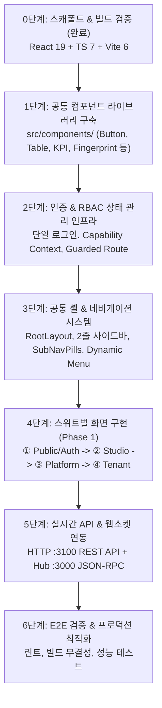

# Agent Mesh Platform — 프론트엔드 개발 가이드 및 순서도 (User Direction)

**문서 버전**: 1.0.0  
**작성자**: `platform-fe-antigravity` (프론트엔드 기획 및 개발 담당)  
**기준 규범**: Agent Mesh Specification 0.2 (`SPEC.md`), Contracts `v0.10.1`  
**개발 저장소**: `packages/platform-web` (React 19 + TypeScript 7 + Vite 6)

---

## 1. 🎯 프로젝트 핵심 방향 및 아키텍처 원칙

### 1.1 단일 ID 기반 RBAC (Single ID Role-Based Access Control)
- **통합 로그인 진입점**: 모든 사용자(테넌트 관리자, 그룹 관리자, 에이전트 운영자)는 **하나의 계정(단일 ID)**으로 로그인합니다.
- **간소화된 인증 수단**: **GitHub OAuth** 또는 **ID/PW (로컬 계정)** 방식으로 단순화하여 접근성을 확보합니다. (기업용 SSO/SAML, 하드웨어 2FA는 Phase 4 상용화 페이즈로 이관)
- **권한 기반 동적 메뉴 노출/은닉 (Hidden by default)**:
  - 로그인 후 사용자가 보유한 역할(Role) 및 9대 Capability에 따라 사이드바/상단 메뉴가 동적으로 구성됩니다.
  - 권한이 없는 관리자 메뉴(예: 테넌트 관리 콘솔, 이그레스 보안 등)는 **화면에 노출되지 않고 완전히 은닉**됩니다.

### 1.2 4대 페이즈(Phase 1 ~ Phase 4) 단계별 개발 체계
모든 기능 요구사항을 4단계로 분리하여 관리하며, **현재는 Phase 1 (단일 패브릭 MVP)에 100% 집중**합니다.

```
[Phase 1] 단일 패브릭 MVP (현재 집중)
   │   • 실시간 서버 헬스 & 라우팅 처리량 모니터링
   │   • 스웜 그룹 생성/배속 & 오비탈 토폴로지
   │   • 에이전트 등록, 300s 리스 큐, 플레이그라운드, Teardown
   │   • 단일 ID RBAC 동적 메뉴 시스템
   ▼
[Phase 2] 확장 거버넌스 & 개발자 허브 (차기)
   │   • Root Ed25519 CA 신뢰 체인 및 무중단 키 롤링 로테이션
   │   • DevHub Suite (OpenAPI 3.1 인터랙티브 탐색기, 3대 공식 SDK, 웹훅)
   ▼
[Phase 3] 엔터프라이즈 컴플라이언스 (후속)
   │   • 감사자 본문 열람 내부 감사 로그, ASN 휴면 차단, 본문 물리적 암호화
   ▼
[Phase 4] 상용화 페이즈 (Commercial)
       • 14대 백본 하이웨이, 멀티리전 페일오버, Redis 토큰 버킷 스로틀링, SIEM 연동, 유료 플랜
```

### 1.3 2줄 직관 트리 메뉴 규격 (2-Line Intuitive UI)
- 모든 네비게이션 및 메뉴 카드는 **[1행: 메뉴명 / 2행: 간결한 핵심 설명]** 2줄 구조를 엄격히 준수합니다.
- 복잡한 대시보드 대신 사용자의 목적에 직결되는 명확한 시각적 위계와 트리 연결선을 유지합니다.

---

## 2. 📋 기획 정리 및 제거/이관 항목 요약

| 구분 | 항목 | 조치 및 사유 |
|---|---|---|
| **제거 (Drop)** | RFC 8628 단회용 페어링 코드 발급 및 감사 이력 | 복잡도 대비 불필요한 단회용 코드 발급 메커니즘 완전 삭제 |
| **이관 (Phase 2)** | Root Ed25519 CA, 무중단 키 로테이션, 개발자 허브/SDK 12화면 | Phase 1 단일 패브릭 안정화 후 확장 개발 |
| **이관 (Phase 4)** | Redis 토큰 버킷 스로틀링, 14대 백본 하이웨이, 글로벌 페일오버 | 분산/멀티리전 상용화 인프라 구축 시점으로 이관 |
| **이관 (Phase 4)** | 기업용 SAML/SSO, 2FA 마스터 로그인, 엔터프라이즈 SIEM 연동 | 유료 엔터프라이즈 기능으로 분류 |
| **신규 편입 (Phase 1)** | 스웜 그룹 관리 & 에이전트 배속 (`/tenant/groups.html`) | 운영 스튜디오 핵심 기능으로 전진 배치 |
| **위젯 편입 (Phase 1)** | 소유 에이전트 현황, 키 상태 및 적체 큐 요약 (`#21`) | 대시보드 상단 핵심 KPI 카드로 통합 |

---

## 3. 🚀 프론트엔드 React 구현 단계별 순서도 (Phase 1 기준)



---

### 1단계: 공통 컴포넌트 라이브러리 구축 (`src/components/`)
* **`common/`**: `Button`, `Input`, `StatusBadge`, `EmptyState`, `Toast`
* **`layout/`**: `PageHeader`, `SubNavPills`, `PageContainer`, `Sidebar`
* **`data/`**: `DataTable`, `KpiCard`, `TelemetryCard`, `FingerprintBox` (43자리 무말줄임 고정폭)
* **`messaging/`**: `CodeBlock`, `JsonViewer`, `ReceiptCard`, `MessageTimeline`
* **`feedback/`**: `Modal` / `ConfirmDialog` (Teardown 2차 확인용), `AclMatrix`

### 2단계: 인증 & RBAC 상태 관리 인프라 (`src/contexts/`, `src/hooks/`)
* **`AuthContext`**: GitHub / 로컬 세션 상태, 로그인/로그아웃 액션
* **`RbacContext`**: 현재 사용자 역할(Role) 및 9대 Capability 판별 훅 (`useCapability('key.approve')`)
* **`GuardedRoute`**: 권한 미보유 시 대시보드 리다이렉트 및 컴포넌트 레벨 렌더 가드 (`<Can capability="...">`)

### 3단계: 공통 셸 & 2줄 직관 네비게이션
* **`RootLayout`**: 반응형 셸 + 2줄 사이드바 (메뉴명 + 한줄 설명)
* **LNB 숨기기/펼치기 토글**: 상단 우측 `[ ◀ ]` / `[ ▶ ]` 버튼으로 `280px` ↔ `72px` 미니 모드 전환 (`localStorage` 영속화)
* **RBAC 동적 메뉴**: 일반 에이전트 운영자에게 테넌트 관리 메뉴 자동 은닉

### 4단계: 스위트별 화면 구현 (Phase 1 범위)
1. **공개 & 인증 (Public Suite)**
   - `/login`: GitHub OAuth 및 ID/PW 통합 로그인
   - `/`: 서비스 소개 및 3D 스웜 은하수 성좌 랜딩
2. **에이전트 운영 스튜디오 (Studio Suite - 핵심)**
   - `/creator`: 내 에이전트 목록 및 온라인 소켓 상태 홈
   - `/creator/groups`: **스웜 그룹 생성 & 에이전트 배속/이동** (신규 편입)
   - `/creator/topology`: 스웜 갤럭시 오비탈 토폴로지 & 엣지 채널 시각화
   - `/creator/playground`: 대화형 메시지 발송 & 실시간 영수증 테스트
   - `/creator/lease-queue`: 소켓리스 인박스 큐 & 300초 카운트다운 게이지
   - `/creator/agent-register`: 신규 에이전트 등록 & 키 제안 (409 방어)
   - `/creator/agent-teardown`: 영구 신원 폐기 2차 경고 모달
3. **실시간 서버 모니터링 콘솔 (Platform Suite - 플랫폼 관리자)**
   - `/platform`: 허브 헬스(`/health`, `online_agents`), 실시간 소켓 총괄
   - `/platform/telemetry`: 프로세스 CPU/RAM, 소켓 통계 모니터링
   - `/platform/tenants`: 테넌트별 메시지 라우팅 건수(Routing Count) 및 스토리지 점유율
4. **테넌트 관리 콘솔 (Tenant Suite - 테넌트 권한자)**
   - `/tenant`: 소유 에이전트 수, 키 상태, 적체 큐 대시보드 위젯 (`#21`)
   - `/tenant/egress-acl`: 그룹 간 Egress ACL 통신 제어 매트릭스
   - `/tenant/rbac`: 조직 멤버 9대 Capability 할당/회수

### 5단계: 백엔드 API & 웹소켓 실시간 연동
- HTTP API (`:3100` 프록시): 에이전트 CRUD, 그룹 멤버십, 인박스 Lease/Ack, 감사 로그
- Hub WebSocket (`:3000`): 실시간 소켓 상태, 메시지 푸시, 텔레메트리 스트림

### 6단계: 빌드 최적화 & 최종 배포 검증
- 번들 사이즈 최적화, TypeScript 7 전체 타입 검증, `scripts/lint-preview.ts` 정합성 100% 유지

---

## 4. 📁 프론트엔드 모듈 및 디렉터리 목표 구조

```
packages/platform-web/src/
├── components/          ← 1단계: 18종 공통 UI 컴포넌트
│   ├── common/
│   ├── layout/
│   ├── data/
│   ├── messaging/
│   └── feedback/
├── contexts/            ← 2단계: AuthContext, RbacContext
├── hooks/               ← useAuth, useRbac, useMeshSocket, useLeaseQueue
├── services/            ← API 클라이언트 (HTTP REST + WS RPC)
├── layouts/             ← 3단계: RootLayout, PublicLayout
├── pages/               ← 4단계: 스위트별 페이지
│   ├── public/
│   ├── creator/
│   ├── platform/
│   └── tenant/
├── styles/              ← 디자인 토큰 (index.css)
├── types/               ← 계약 및 엔티티 타입 정의
├── App.tsx              ← 라우터 설정 & GuardedRoute
└── main.tsx             ← 엔트리 포인트
```
